[](https://badge.fury.io/js/sfeir-school-theme)

# Sfeir School Theme

This repository is an Open Source theme for RevealJS presentations. It respect the graphical theme of [@Sfeir](https://github.com/sfeir) company.

You can preview it here : https://sfeir-school-theme.netlify.com/

* [How to use it](https://github.com/sfeir-open-source/sfeir-school-theme/#how-to-use-it)
* [Features](https://github.com/sfeir-open-source/sfeir-school-theme/#features)
  * [Specifics Slides](https://github.com/sfeir-open-source/sfeir-school-theme/#specifics-slides)
    * [First slide](https://github.com/sfeir-open-source/sfeir-school-theme/#first-slide)
    * [Sfeir School presentation Slide](https://github.com/sfeir-open-source/sfeir-school-theme/#sfeir-school-presentation-slide)
    * [Speaker Slide](https://github.com/sfeir-open-source/sfeir-school-theme/#speaker-slide)
    * [Transitions slides](https://github.com/sfeir-open-source/sfeir-school-theme/#transitions-slides)
  * [Custom Backgrounds](https://github.com/sfeir-open-source/sfeir-school-theme/#specifics-colors-backgrounds)
  * [Different Layout](https://github.com/sfeir-open-source/sfeir-school-theme/#different-layout)
  * [Slides with code](https://github.com/sfeir-open-source/sfeir-school-theme/#slides-with-code)
  * [Exercices](https://github.com/sfeir-open-source/sfeir-school-theme/#exercices)
  * [Helpers](https://github.com/sfeir-open-source/sfeir-school-theme/#helpers)
    * [List with fragments ](https://github.com/sfeir-open-source/sfeir-school-theme/#list-with-fragments)
* [Releases Notes](https://github.com/sfeir-open-source/sfeir-school-theme/wiki/Releases-Notes)


# How to use it:

## Npm

```sh
# run
$npm install sfeir-school-theme
```

## Cloning the repo

Let's consider that the path to reveal engine is at `$REVEAL_PATH`

Clone the repository in your project (`$SFEIR_THEME_PATH`)


## Link

According that `$SFEIR_THEME_PATH` is the base path of the theme
In your reveal index.html add the following lines:
```html

...
<head>
    ...
    <!-- For syntax highlighting : Use Tomorrow.css -->
    <link rel="stylesheet" href="$REAVEAL_PATH/highlight.js/src/styles/tomorrow.css">

    ...
    <!-- Sfeir Theme includes -->
    <link rel="stylesheet" href="$SFEIR_THEME_PATH/dist/css/sfeir-school-theme.css" id="theme">
    <script type="module" src="$SFEIR_THEME_PATH/dist/js/sfeir-theme.js"></script>
</head>
...

```

Enjoy!

# RevealJS

This theme use target for [RevealJS](https://revealjs.com/#/) so all you can do with RevealJS is available with theme.

# Features

* Specifics slides management: 
  * First Slide
  * Speaker Slide
  * Transitions Slides
  * Multiples backgrounds
* Code Higlighting (sequential highlighting will come after)
  * Choice of Dark code or Light code
  * Choice of font
* Two columns layout
* Somes helpers for images
* Easyer management of restitution slides.
* Expose some custom properties corresponding to the theme.
* As it's controlled by class, it's compatible with markdown syntax or html

## Specifics Slides 

### First slide


```md
<!-- .slide: class="first-slide" sfeir-level="1" sfeir-techno="pwa" -->

# **Welcome to Sfeir School**
## **PWA 100**
```


* Attribute: `sfeir-level` could change from 1 to 3
* Attribute: `sfeir-techno` display the technology of the sfeir school in the badge of sfeir school.

### Sfeir School presentation Slide

```md
<!-- .slide: class="school-presentation" -->

<div class="wifi">
    <span class="key">wifi:</span><span>SSID</span><br>
    <span class="key">mdp:</span><span>PASSWORD</span>
</div>
```


### Speaker Slide

```md
<!-- .slide: class="speaker-slide" -->

# Hello ! @SFEIR


<h2> Jean-François<span> Garreau</span></h2>

### CTO front
<!-- .element: class="icon-rule icon-first" -->

### @jefbinomed
<!-- .element: class="icon-twitter icon-second" -->

### fake.email@sfeir.com

<!-- .element: class="icon-mail icon-third" -->
```


There is color alternative for these slide, just add `blue` or `green` class to the slide : 


```md
<!-- .slide: class="speaker-slide blue" -->

OR 

<!-- .slide: class="speaker-slide green" -->

...
```


You can also change the order of sub information (here CTO Front & @jefbinomed). You can set up to 4 sub informations : `icon-first` | `icon-second` | `icon-third`.

For the moment, only 3 icons are registered for speaker slide : `icon-rule` (for the job) | `icon-twitter` for twitter | `icon-mail` for the mail

You can also change the number of badge (one -> three) `first-badge` | `second-badge` | `third-badge`

### Transitions slides

```md
<!-- .slide: class="transition" -->

# Management of custom slides
```


You can use those class for transitions slides : 
* `blue`: the text background of transition will be set to blue
* `green`: the text background of transition will be set to blue
* `underline`: the text will be underline instead of background
* `left`: the text will be left aligned
* `right`: the text will be right aligned
* `top`: the text will be stick to the top
* `bottom`: the text will be stick to the bottom
* `bg-white` / `bg-pink` / `bg-blue` / `bg-green` : the background will be in a different color
* `transition-bg-grey-1` -> `transition-bg-grey-7` : different background images

## Transition with background text in blue or green

```md
<!-- .slide: class="transition blue" -->

# Transition blue
```

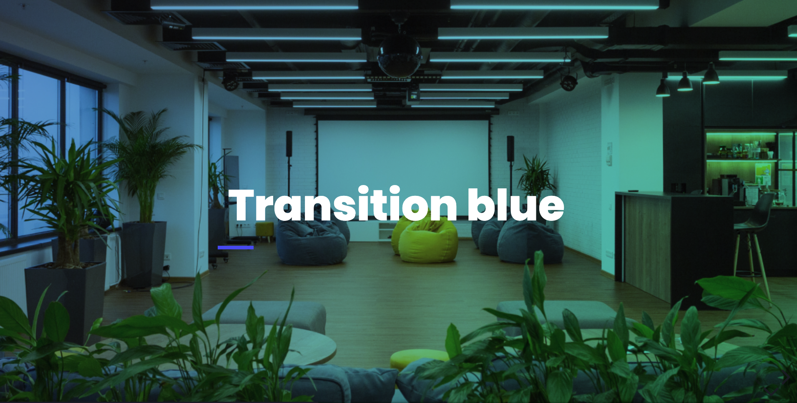

or in `green`

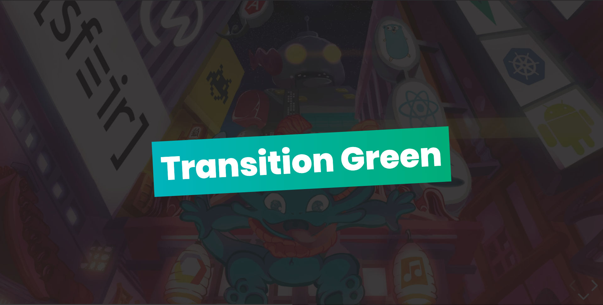

## Transition with text underline

```md
<!-- .slide: class="transition underline" -->

# Transition underline
```

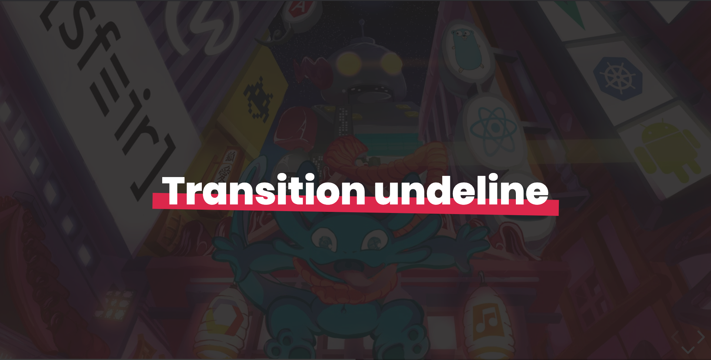

## Transition with text left aligned

```md
<!-- .slide: class="transition left" -->

# Transition left
```


* `transition right` for right text aligned


* `transition top` for top text aligned


* `transition bottom` for bottom text aligned


## Specifics Colors Backgrounds

Here is the list of possible backgrounds: 

```md
<!-- .slide: class="transition bg-white" -->

# Transition
```

* `bg-white`


* `bg-pink`


* `bg-blue`


* `bg-green`
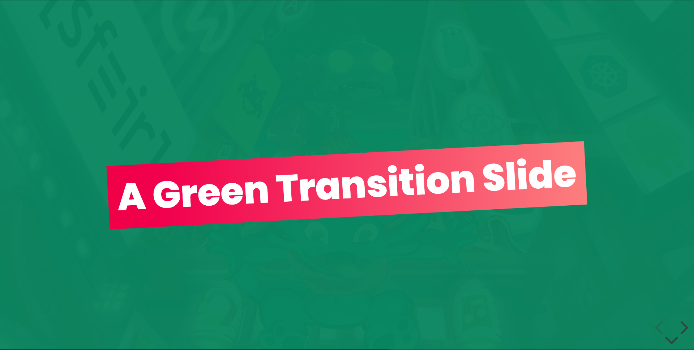

## Transition background grey

Here is the list of possible grey background

```md
<!-- .slide: class="transition-bg-grey-1" -->

# Sfeir bg grey 1
```

* `transition-bg-grey-1`


* `transition-bg-grey-2`


* `transition-bg-grey-3`
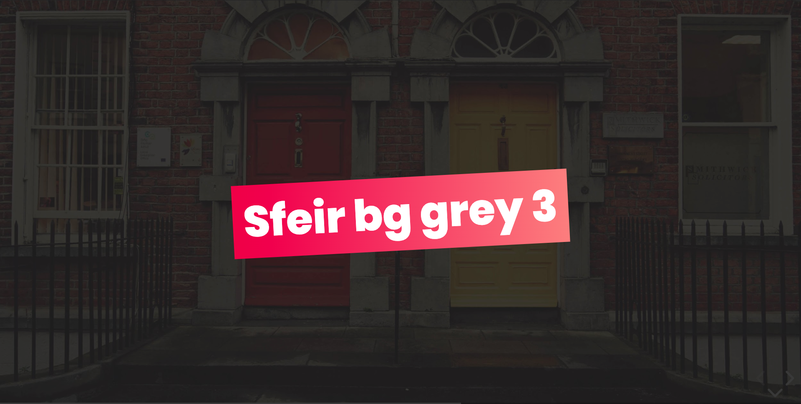

* `transition-bg-grey-4`


* `transition-bg-grey-5`


* `transition-bg-grey-6`
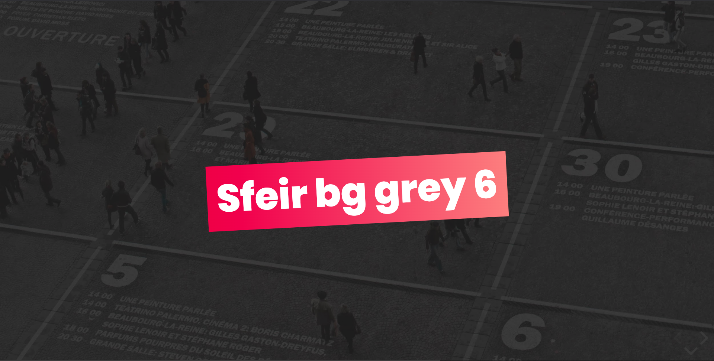

* `transition-bg-grey-7`


## Transition with custom Image

```md
<!-- .slide: data-background="./assets/images/dark_background.jpeg" class="transition" -->

# A Custom Transition Slide
```

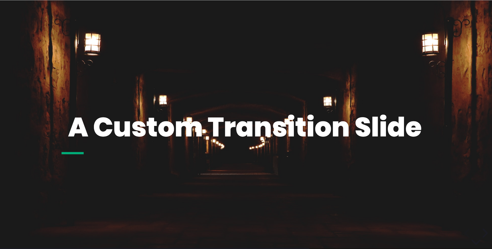

## Transition with background color

```md
<!-- .slide: .slide: data-background="#3d4349" class="transition" -->

# Transition with bg color
```


## Different Layout

### Two column layout

```md
<!-- .slide: class="two-column-layout"-->

# A Title

##--##

content left

##--##

content right
```

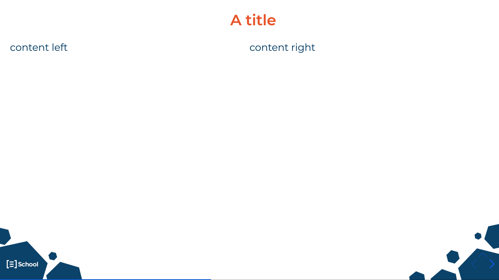

## Slides with code

You should use triple **\`** sufix by the langage. Code slides in Reveal are based on [highlight.js](https://highlightjs.org/). Please refer Highlight site to see the support of langages.

```md

<!-- .slide: class="with-code" -->

## Some Code (with monospace font)


` ` `xml
<?xml version="1.0" encoding="utf-8"?>
<LinearLayout xmlns:android="http://schemas.android.com/apk/res/android"
    android:orientation="vertical"
    android:layout_width="fill_parent"
    android:layout_height="fill_parent"
    >
    <TextView
        android:layout_width="fill_parent"
        android:layout_height="wrap_content"
        android:text="@string/hello"
        />
</LinearLayout>
` ` `
```


You can also use class to customise the slide: 

* `with-code-dark`: to use a dark theme (default is light theme)
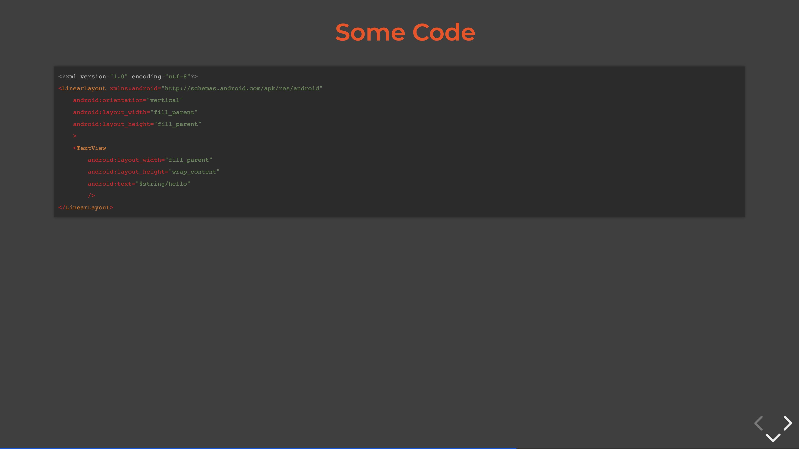

* `with-code-bg-dark`: to use a dark theme for code bloc (default is light theme)
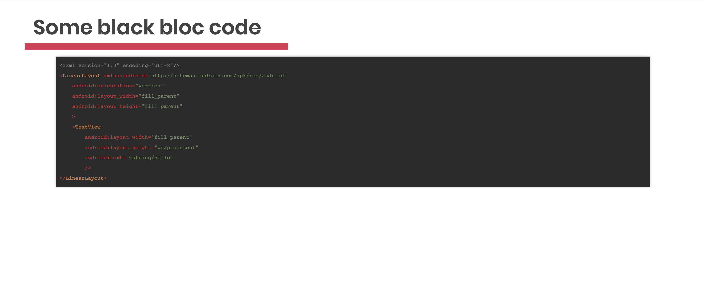

* `consolas`: will use consolas font
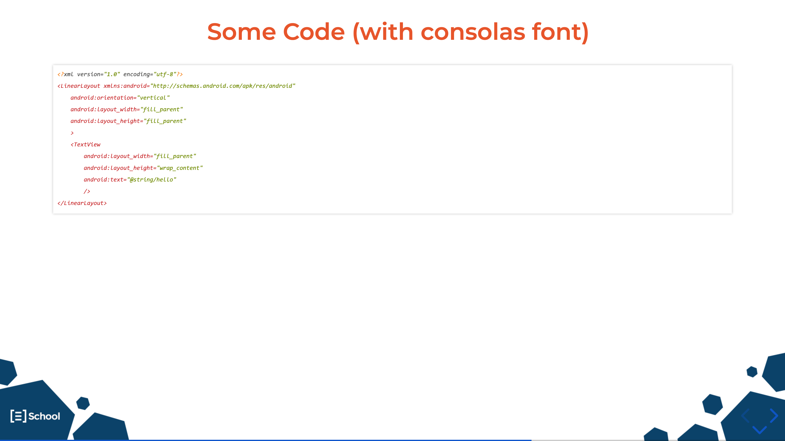

* `inconsolata`: will use inconsolata font
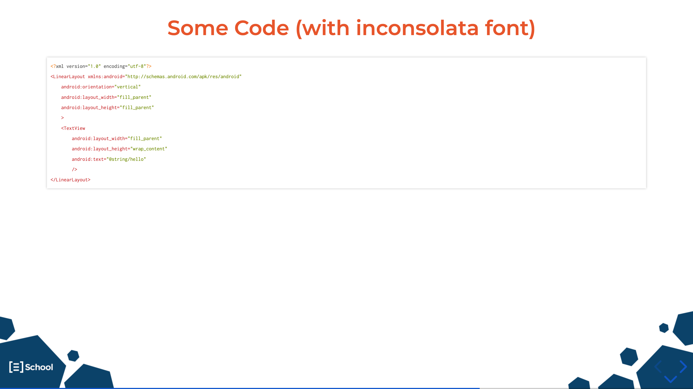

* `big-code`: will use a big size of font
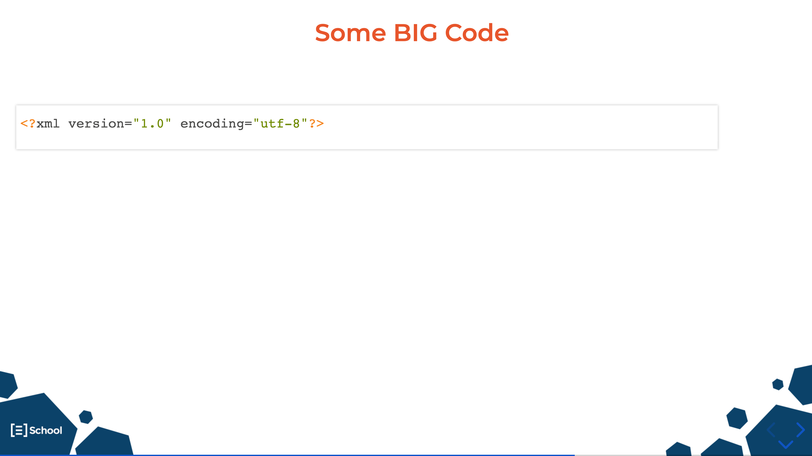

there is a minor varient of `big-code`, add the class `alone` if there is only one code at screen to position it in the center of screen. Else it will be relative to it's parent

### Use an other HighlightJS theme

HighlightJS propose lots of themes that could use.

1. Choose your theme : https://highlightjs.org/static/demo/
2. Overrides class `with-code` or `with-code-dark` in a stylesheet import in your html

```css
// To override the highlightJS theme you can do like this

.with-code {
    @import "../../../node_modules/highlight.js/styles/tomorrow";
}
.with-code-dark {
    @import "../../../node_modules/highlight.js/styles/darcula";
}

```

## Exercices

To produce exercices slides: 

```md
<!-- .slide: class="exercice" -->
# Exercice Title
## Exercice
<br>
1. First step
2. Second step
3. Third step
<br>
Additionnal Advice
### Step: push-1
```

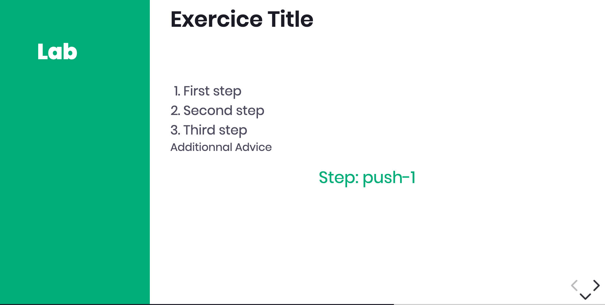

## Helpers

This theme comes with lots of css helpers to help you to position your elements simply

### Center image horizontally

You could center and image with 3 different ways

```markdown

<!--  First way -->


<!--  Second way -->

```

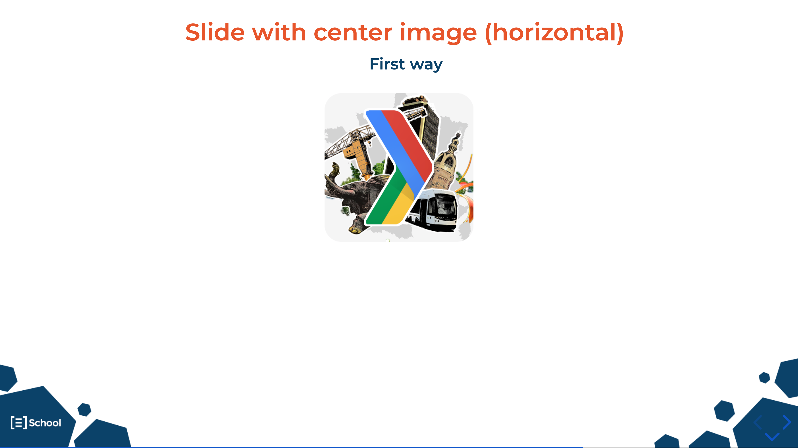

### Center image horizontally en vertically

You could center an element in the slide with 2 different ways

```markdown

<!-- First way -->
<div class="full-center">
    
</div>


<!-- Second way : add class on slide but only one image on the page! -->
<!-- .slide: class="full-center" -->


```

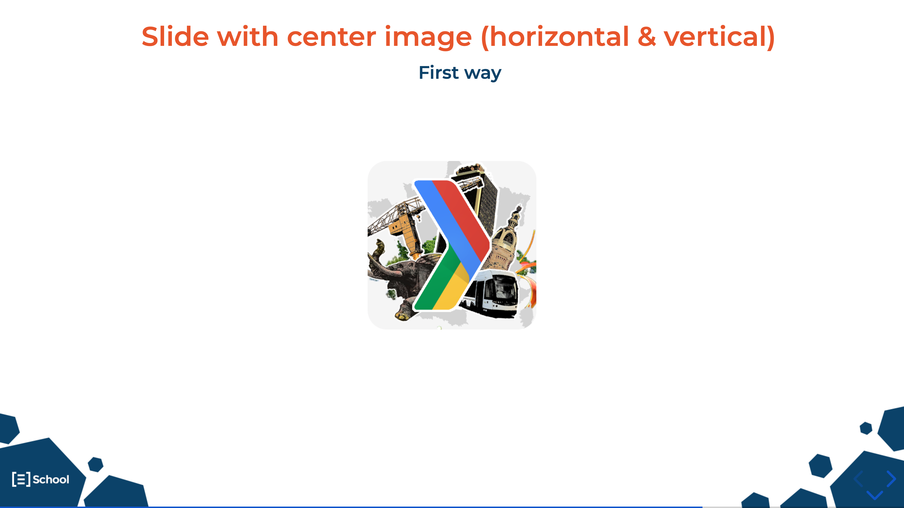

### Use Flex to display elements with auto wrap

```markdown

<!-- First way : Add on the slide the class -->
<!-- .slide: class="flex-row" -->

# Flex row alignement with auto wrap

## First way


<!-- Second way : WARNING don't format your code!!
Else revealJS will add some '<p>' tags and destroy the layout -->
<div class="flex-row">


</div>

````
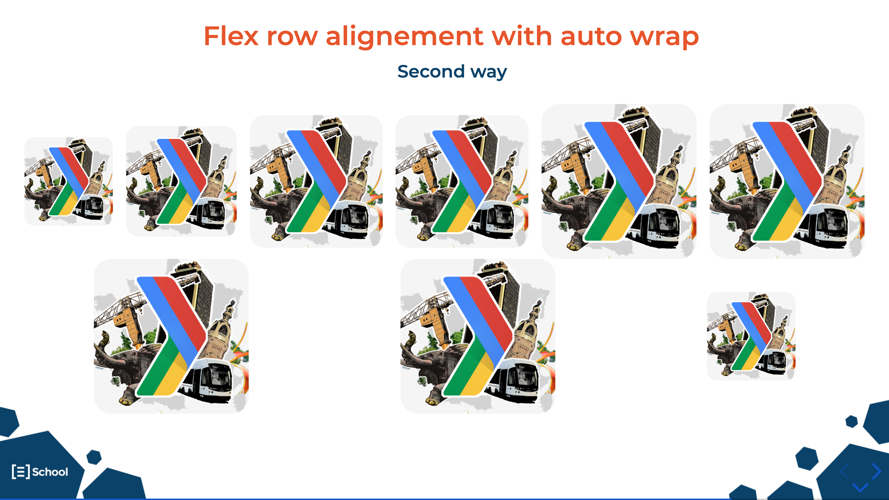

### Play with images sizes

Some selectors are add to the theme to easily fix size of images in the slide. Note that RevealJS use a mecanism of perspective to preserve size. If you ask to your presentation to be with resolutions 1920x1080, all size you set in your slides will respect that, even if you are on a 1024 screen or bigger.

* `w-N`: your image will have a with of **N** (N between 50px and 1000px by steps of 50px)
* `h-N`: your image will have a height of **N** (N between 50px and 1000px by steps of 50px)
* `wm-N`: your image will have a with-max of **N** (N between 50px and 1000px by steps of 50px)
* `hm-N`: your image will have a height-max of **N** (N between 50px and 1000px by steps of 50px)

you can use thoses helpers in `alt` or `class` of your elements

```markdown
Image (w-500) : 


Div background: 

<div style="background:red;" class="w-500 h-200"> w-500 h-200</div>
```
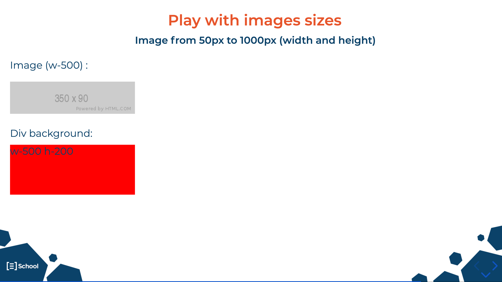


```markdown
Image : 


Div background: 

<div style="background:red; width:600px;" class="wm-500 h-200"> (height:600px) wm-500 h-200</div>
```
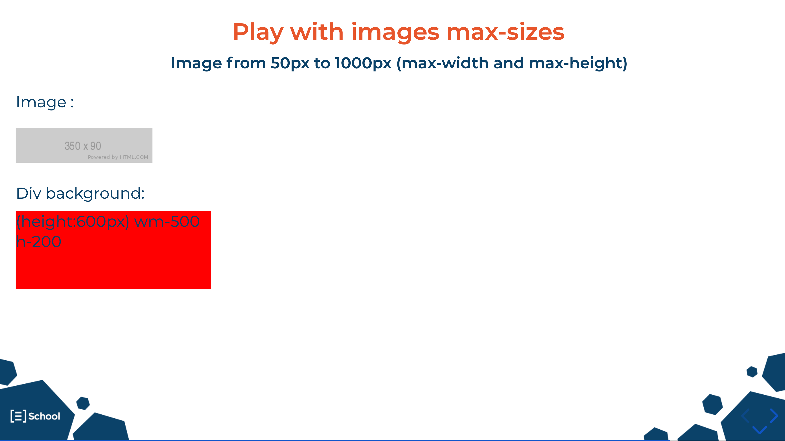

### Play with images margin-top or bottom

Some selectors are add to the theme to easily fix margin-top/bottom of images in the slide to easily trick for the position.
* `mt-N`: your image will have a magin-top of **N** (N between 10px and 1000px by steps of 10px)
* `mb-N`: your image will have a margin-bottom of **N** (N between 10px and 1000px by steps of 10px)

you can use thoses helpers in `alt` or `class` of your elements

```markdown


```


```markdown
Image : 


Div background: 

<div style="background:red; width:600px;" class="wm-500 h-200"> (height:600px) wm-500 h-200</div>
```


### Full With Image

To have image that take all the horizontal space, you could use 3 ways:

```markdown

<!-- First way -->


<!-- Second way -->

```


### Full Height Image

You can ask to an image to take the whole height of it's parent

```markdown
<div style="height:600px; width:100%; background:red;">
    
</div>
```
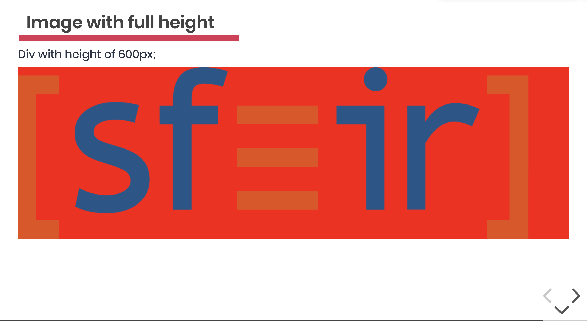

### Float Left or Right

You can use float-right or float-left display 

```markdown
<!-- First way -->


Lorem ipsum dolor sit amet, consectetur adipiscing elit. Proin nec risus leo. Vestibulum condimentum orci in urna auctor aliquet. Quisque mi erat, placerat non porttitor ut, gravida eu erat. Fusce semper ipsum vel nibh porttitor aliquam. Cras sed porttitor est, id scelerisque odio. Pellentesque sit amet imperdiet ex. Aliquam erat.

<!-- Second way -->


Lorem ipsum dolor sit amet, consectetur adipiscing elit. Proin nec risus leo. Vestibulum condimentum orci in urna auctor aliquet. Quisque mi erat, placerat non porttitor ut, gravida eu erat. Fusce semper ipsum vel nibh porttitor aliquam. Cras sed porttitor est, id scelerisque odio. Pellentesque sit amet imperdiet ex. Aliquam erat.

```
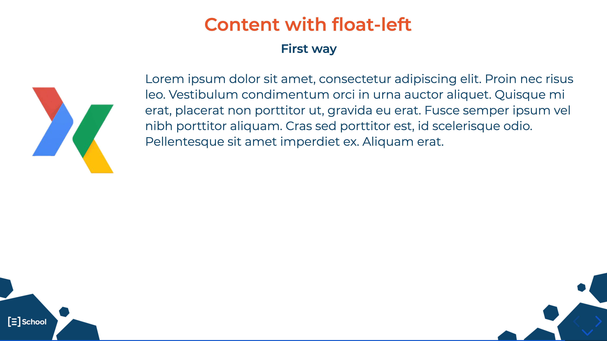

Lorem ipsum dolor sit amet, consectetur adipiscing elit. Proin nec risus leo. Vestibulum condimentum orci in urna auctor aliquet. Quisque mi erat, placerat non porttitor ut, gravida eu erat. Fusce semper ipsum vel nibh porttitor aliquam. Cras sed porttitor est, id scelerisque odio. Pellentesque sit amet imperdiet ex. Aliquam erat.

### Create content for the restitution only

With this theme you can easily create content that is different between, what you will play on stage and what you will give to your attendees without a complete rewrite of your slides. This configuration is a pair between a key specified in your index.html and a key present in your slides.

**Index.html Configuration**

```html
<body>
	<div class="reveal">
		<div class="slides" data-type-show="prez">
        ...
        </div>
    </div>
</body>
```

**Slides configuration**

```markdown
<!-- .slide: data-type-show="prez" -->

## A slide for prez only

A few words !
```

The slide 'A slide for prez only' will be visible only if the attribute `data-type-show` on index.html is set to "prez".

With this technique, you can easily create 2 versions of your index.hml, one with `data-type-show` to **prez** and one with `data-type-show`to **full** and in your slides, you have something like that 

```markdown
<!-- .slide: data-type-show="prez" -->

## A slide for prez only

A few words !

##==##
<!-- .slide: data-type-show="full" -->

## A slide for publication only

Lorem ipsum dolor sit amet, consectetur adipiscing elit. Proin nec risus leo. Vestibulum condimentum orci in urna auctor aliquet. Quisque mi erat, placerat non porttitor ut, gravida eu erat. Fusce semper ipsum vel nibh porttitor aliquam. Cras sed porttitor est, id scelerisque odio. Pellentesque sit amet imperdiet ex. Aliquam erat.
```

If nothing is set in the markdown, the slide will be available for both versions.


### List with fragments 

Sometimes, you will need to use revealJS fragments (animation to reveal an element) on list elements. To do this, you could write directly html content or you can use a meta at the end of the list: 

```markdown
1. List Item 1
2. List Item 2
2. List Item 3
<!-- .element: class="list-fragment" -->

* Item 1
* Item 2
* **Item 3**
<!-- .element: class="list-fragment" -->
```
This will apply on all elements of the list the class `fragment` or use html 
```html
<ol>
    <li class="fragment">List Item 1</li>
    <li class="fragment">List Item 2</li>
    <li class="fragment">List Item 3</li>
</ol>

<ul>
    <li class="fragment">Item 1</li>
    <li class="fragment">Item 2</li>
    <li class="fragment"><strong>Item 3<strong></li>
</ul>
```