[](https://badge.fury.io/js/sfeir-school-theme)

# SFEIR School Theme

This repository is an Open Source theme for RevealJS presentations. It respect the graphical theme of [@SFEIR](https://github.com/sfeir) company.

You can preview it here : https://sfeir-school-theme.netlify.app/

- [Releases Notes](https://github.com/sfeir-open-source/sfeir-school-theme/wiki/Releases-Notes)

# How to use it:

## Npm

```sh
# run
$npm install sfeir-school-theme
```

## Cloning the repo

Let's consider that the path to reveal engine is at `$LIBS_PATH`

Clone the repository in your project (`$SFEIR_THEME_PATH`)

## Link

You should have a folder `web_modules/sfeir-school-theme`. In this folder you should have the bundled sfeir theme (either copy the demo web_modules or build it with `npm run build`).

In your index.html add the following lines:

```html
...
<head>
    ...
    <!-- SFEIR Theme includes -->
    <script type="module" src="./scripts/slides.js"></script>
    <link
        rel="stylesheet"
        type="text/css"
        href="./web_modules/sfeir-school-theme/dist/sfeir-school-theme.css"
        id="theme" />
</head>
<body>
    <div class="reveal">
        <!-- Any section element inside of this container is displayed as a slide -->
        <div class="slides" data-type-show="prez"></div>
    </div>
</body>
...
```

and a basic `slides.js`:

```JavaScript
import { SfeirThemeInitializer } from "../web_modules/sfeir-school-theme/dist/sfeir-school-theme.mjs";

// One method per module
function schoolSlides(typeShow) {
  return [
    "00_intro.md",
    "01_speaker.md",
    "10_chapter1.md",
    "11_layouts.md",
    "15_vertical.md",
    "20_specifics_slides.md",
    "30_code_slides.md",
    "40_helpers.md",
    "50_modes.md",
  ];
}

function formation(typeShow) {
  return [
    //
    ...schoolSlides(typeShow),
  ].map((slidePath) => {
    return { path: slidePath };
  });
}

SfeirThemeInitializer.init(formation);
```

Enjoy!

# RevealJS

This theme use target for [RevealJS](https://revealjs.com/#/) so all you can do with RevealJS is available with theme.

You can still use RevealJS API by importing `Reveal` object in `import { Reveal } from "../web_modules/sfeir-school-theme/dist/sfeir-school-theme.mjs";`

## Features availables:

There is too many features to list them all, but here somes usefull:

- Code Higlighting (sequential highlighting will come after)
    - Choice of Dark code or Light code
    - Choice of font
    - Progess Highlithing
- As it's controlled by class, it's compatible with markdown syntax or html
- Fragment management to have progress display of elements
- Print the slides (see bellow)

Look at revealJS Site to see what is possible

# TalkControl

The theme use [TalkControl RevealJS extensions](https://github.com/TalkControl/talk-control-revealjs-extensions/) so all you can do with this extension is available in the theme

## Features availables:

- Specifics slides management:
    - Speaker slide
    - Transition Slides
    - I18N for your slides mechanism
    - Multiple Columns layout
    - Copy/paste for code slides
    - Configurations for slides
    - Helpers for positionning / images size / credits notes
    - Admonition
    - Quotes slides
    - QrCodes
    - Font icons (material / feather / fontawesome)
    - UI
        - Slide selector
        - Define theme
        - Define data-type
        - Define language

See the documentation about all thoses features [here](https://github.com/TalkControl/talk-control-revealjs-extensions/blob/main/docs/how-to.md)

# Features add to Sfeir School theme

- Specifics slides management:
    - First Slide
    - Speaker Slide (rework)
    - Transitions Slides (some configurations)
    - Three theme mode available : institute, school or conf
    - Blur slide
    - Exercices Slides

## Play with mode theme

Lots of trainings given by SFEIR School program are also available with the paid program SFEIR Institute (training organism of SFEIR company). Since v5 both programs share the **SFEIR 2026 identity**: Epilogue and Space Grotesk type, copper `#E4AA5D` as the single fill colour, warm neutrals, and photos where they matter — gold dust, gold arc or dark rock on covers, dividers and dark slides, over a plain off-white surface on content slides. Cards are translucent glass, rounded at 12 px, with no shadows and no gradients.

The two programs differ by a **signature colour** on small elements only (eyebrow, list markers, title underline, transition line, level chips) and by the cover lockup: SFEIR Institute is the corporate copper throughout; SFEIR School carries an Émeraude green signature (`#0D5A2E` on light, `#6BC68F` on dark) while its fills, numerals and photos stay copper. Everything else is identical, so one deck serves both programs by switching `data-theme`. See `docs/charte-2026/06-authoring-guide.md` for how to write on-brand slides.

To this end, you have two possibilities:

- Use HTML attribute `data-theme`;
- Use URL parameter `data-theme`.

Below are `index.html` and URL examples for the available themes.

1. **[Institute](https://sfeir-school-theme.netlify.app?data-theme=institute)**

```html
<body>
    <div class="reveal">
        <div class="slides" data-theme="institute">...</div>
    </div>
</body>
```

https://sfeir-school-theme.netlify.app/index.html?data-theme=institute#/

2. **[School](https://sfeir-school-theme.netlify.app/index.html#/)** (default theme)

```html
<body>
    <div class="reveal">
        <div class="slides" data-theme="school">...</div>
    </div>
</body>
```

https://sfeir-school-theme.netlify.app/index.html?data-theme=school#/

3. **[Conf](https://sfeir-school-theme.netlify.app?data-theme=conf)**

```html
<body>
    <div class="reveal">
        <div class="slides" data-theme="conf">...</div>
    </div>
</body>
```

https://sfeir-school-theme.netlify.app/index.html?data-theme=conf#/

The default value is "school" mode.

Here is an example of first slide according to if you set mode to institute or not.

> **Note:** the screenshots in this README predate the 2026 identity and will be regenerated.

### Institute mode :

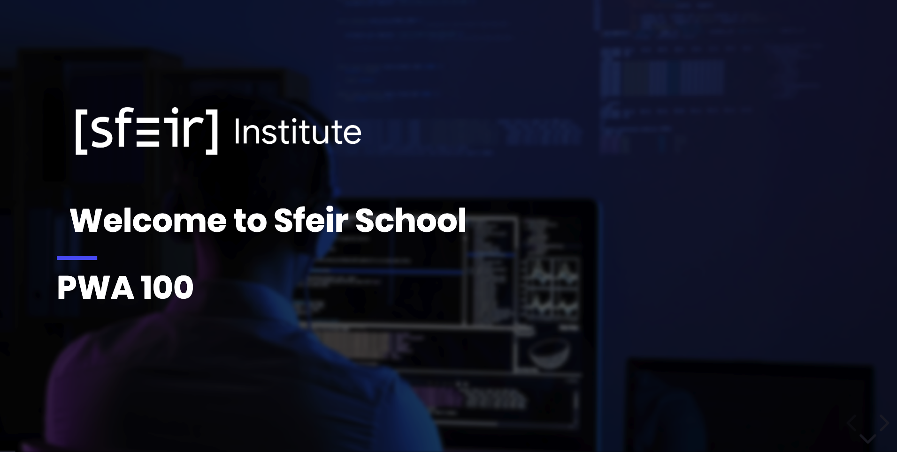

### Conf mode :

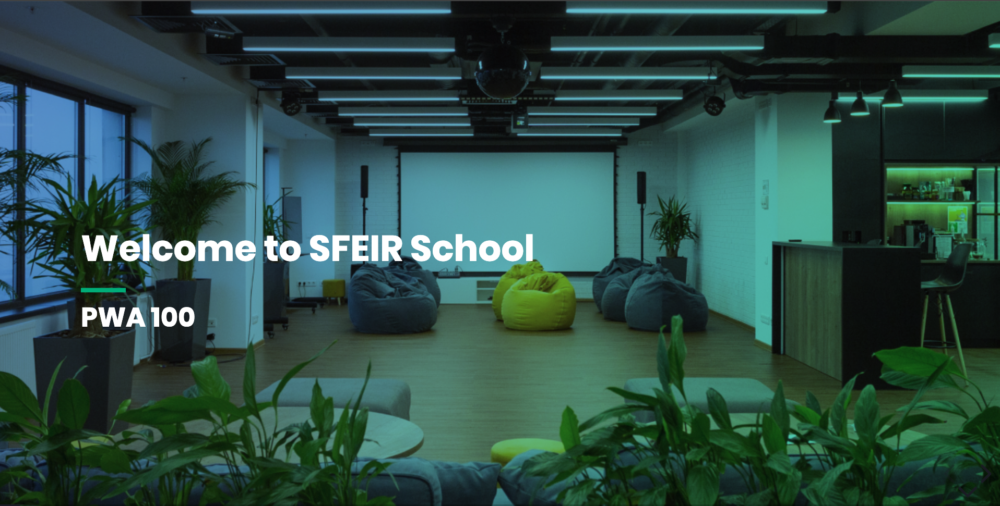

### Normal mode (or school mode):


Here are the impacts of the mode :

- The first slide: lockup (`[sfeir] School` / `[sfeir] Institute`) and the eyebrow `[ SFEIR SCHOOL | TECHNO ]`
- The signature colour (`--sfeir-accent`): eyebrows, list markers, the underline of titles, the line under transition titles, level chips, the colour of feather icons, credits
- `conf` removes the lockup, the eyebrow, the corner mark and the tagline

Backgrounds, fills, cards, code blocks and table headers are the same in every mode.

## I18N your slides

If you want to translate your slides, you simply have to add the extension corresponding to the translate langage : `XX-slide.EN.md`.

The default langage used is French, so by default a file with no extension or when you ask french slides, the engine provides you the markdown files without lang suffix.

If your asking a slide that is not available in the asked langage, the engine will provide you the "default" langage slide.

To resume, asking `FR` langage will serve you default markdown files.

To specify the langage you want to use, you have two options :

- define the langage in the index.html
- adding a parameter specifying the langage

### Configuration in the index.html

```html
<body>
    <div class="reveal">
        <div class="slides" data-lang="EN">...</div>
    </div>
</body>
```

### Configuration by URL

Simply add a query parameter in the URL `data-lang` with the wanted langage after.

## Specifics Slides

### First slide

```md
<!-- .slide: class="first-slide" sfeir-level="1" sfeir-techno="pwa" -->

# **Welcome to SFEIR School**

## **PWA 100**
```


- Attribute: `sfeir-level` could change from 1 to 3 — rendered as three pill chips next to the eyebrow, filled up to the level
- Attribute: `sfeir-techno` display the technology of the SFEIR school — rendered in the eyebrow `[ SFEIR SCHOOL | PWA ]` above the title (`[ SFEIR SCHOOL ]` when omitted)

The cover sits on the gold-dust photo, with the program lockup top-left and the SFEIR wordmark over the tagline bottom-right.

### Speaker Slide

```md
<!-- .slide: class="speaker-slide" -->

<div class="speaker-slide">

# Hello ! @SFEIR

## Jean-François <b>Garreau</b>

### CTO Front

### fake.email@sfeir.com

### @jefbinomed


</div>
```


You can have up to 4 sub information (here CTO Front & @jefbinomed).

You can also have up to 6 badge

### Transitions slides

```md
<!-- .slide: class="transition" -->

# Management of custom slides
```

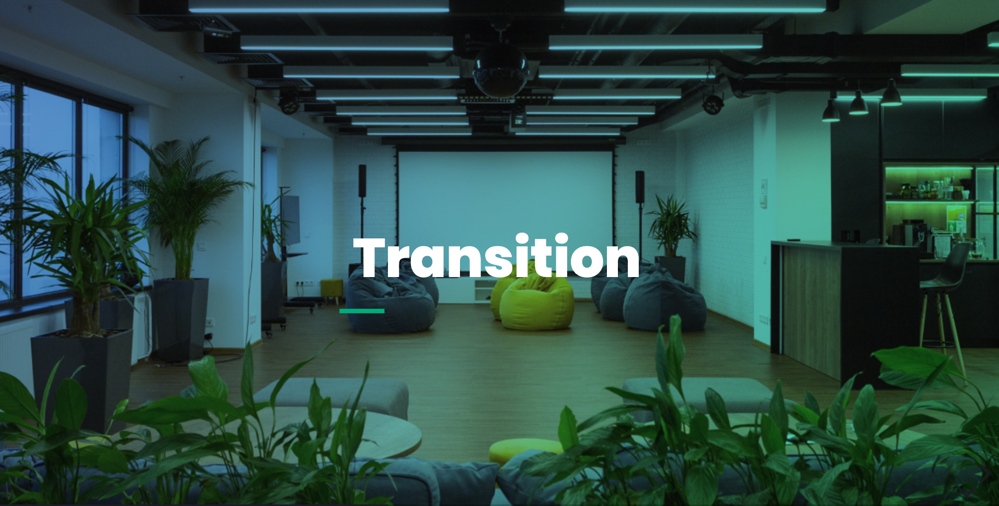

A transition sits on the gold-arc photo by default, title bottom-left. You can use those class for transitions slides :

- `left`: the text will be left aligned
- `right`: the text will be right aligned
- `top`: the text will be stick to the top
- `bottom`: the text will be stick to the bottom
- `bg-plaster`, `bg-dust`, `bg-arc`, `bg-rock`, `bg-flecks`, `bg-bokeh`, `bg-brown`, `bg-sand`, `bg-pour` : pick another photo (see "Photo backgrounds" below)
- `bg-overlay` : add a dark scrim over the photo for weak projectors
- `transition-bg-sfeir-1` -> `transition-bg-sfeir-3` : the gold-dust, gold-arc and slate-rock photos
- _Deprecated, removed in v6_: `blue` / `green` (no-op, the underline is the program signature), `bg-white` / `bg-blue` / `bg-green`, `transition-bg-green-1` -> `-6`, `transition-bg-blue-1` -> `-3` (each resolves to one of the photos above)

## Transition with the program signature

The underline under a transition title is the program signature colour: Émeraude in `school`, copper in `institute`. The `blue` and `green` modifiers still parse but change nothing.

```md
<!-- .slide: class="transition" -->

# Transition
```

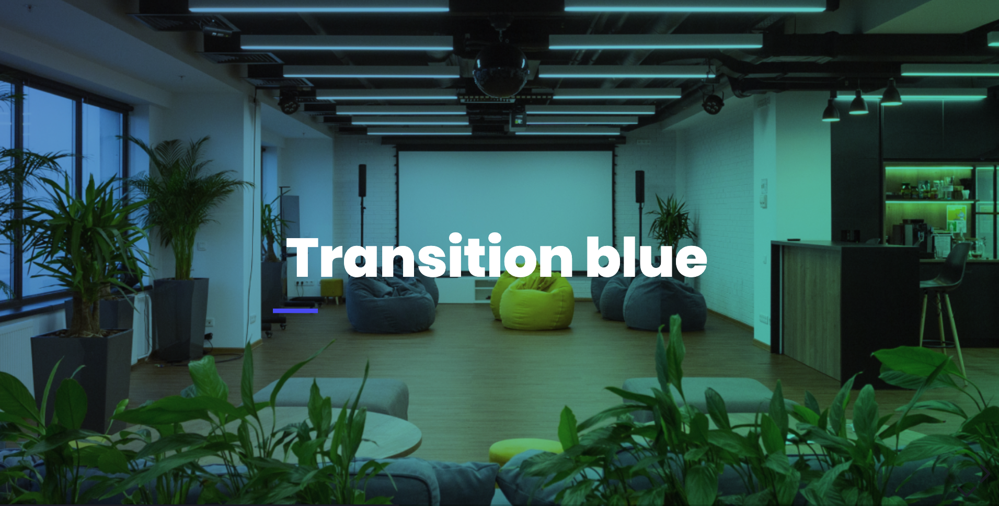

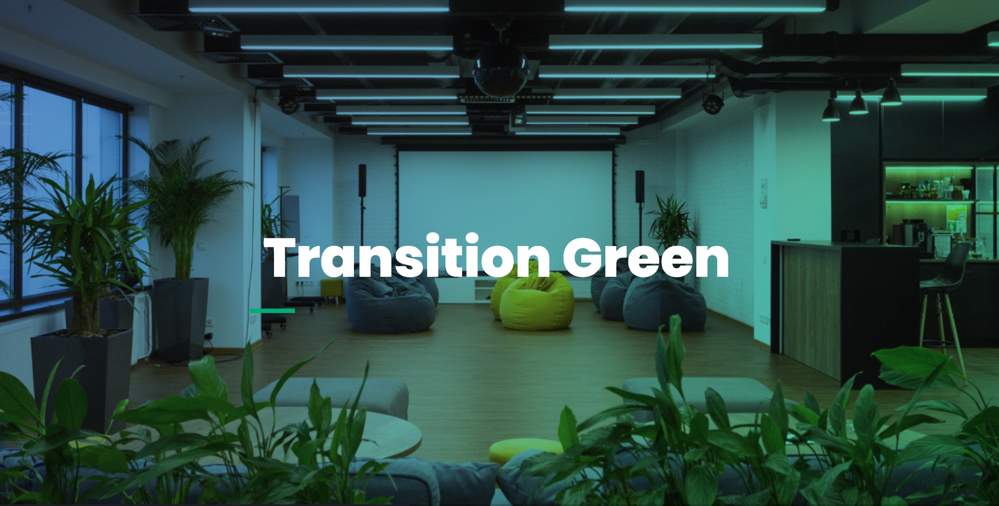

## Transition with text left aligned

```md
<!-- .slide: class="transition left" -->

# Transition left
```

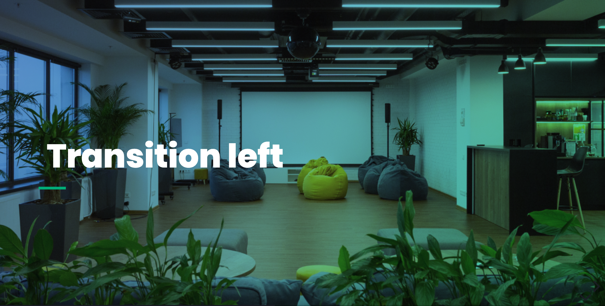

- `transition right` for right text aligned

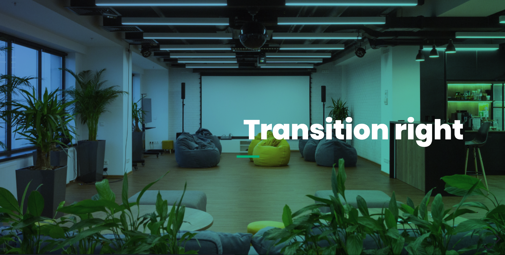

- `transition top` for top text aligned

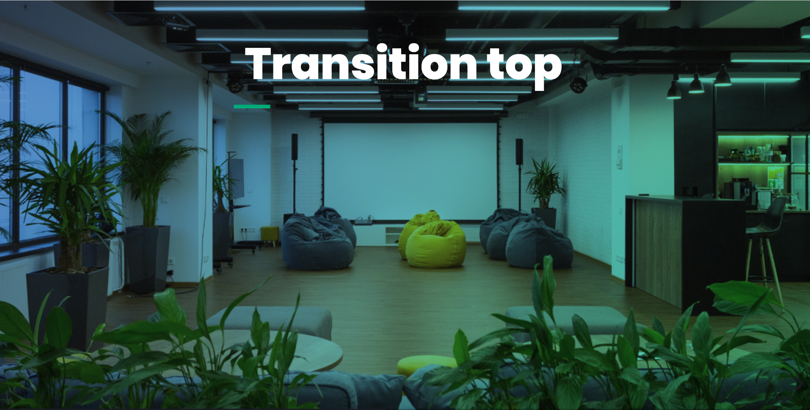

- `transition bottom` for bottom text aligned

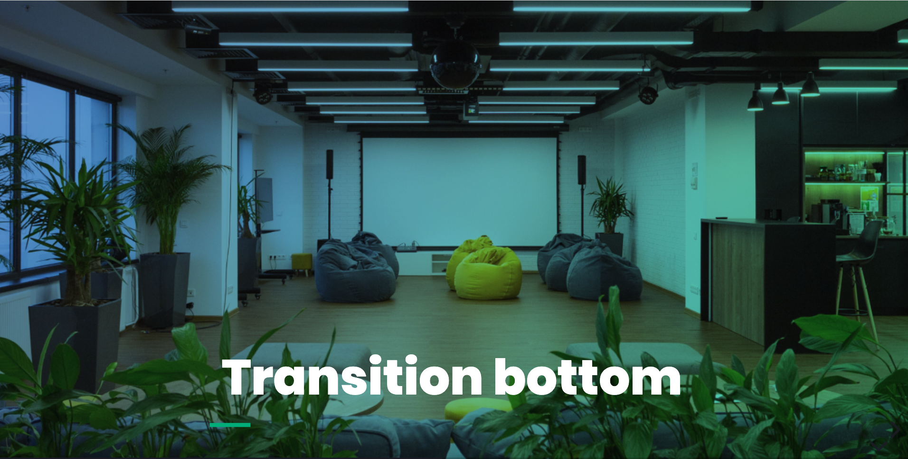

## Photo backgrounds

Content slides sit on a plain off-white surface; covers, dividers and dark slides sit on a photo from the 2026 identity. Add one of these classes to any slide to pick a photo, plaster wall included. Dark photos switch the text and the accent to their on-dark values automatically, and a flat `#181A1F` sits under every dark photo while it loads.

```md
<!-- .slide: class="bg-rock" -->

# Dense text on a dark photo

<!-- .slide: class="bg-sand bg-overlay" -->

# The one photo that needs the scrim
```

| Class        | Photo                       | Use                                              |
| ------------ | --------------------------- | ------------------------------------------------ |
| `bg-plaster` | off-white plaster (light)   | opt-in textured light background                 |
| `bg-dust`    | gold particles on black     | covers, closings, hero statements                |
| `bg-arc`     | gold horizon arc            | section dividers (the `transition` default)      |
| `bg-rock`    | dark slate                  | dense text on dark — the safest                  |
| `bg-flecks`  | charcoal rock, gold flecks  | dark content                                     |
| `bg-bokeh`   | warm bokeh discs            | statements; keep text off the discs              |
| `bg-brown`   | soft copper blur            | dense text on dark                               |
| `bg-sand`    | gold glitter, bright centre | **always with `bg-overlay`**                     |
| `bg-pour`    | sand trickle, portrait      | statements; also the exercice band               |
| `bg-overlay` | modifier                    | 55 % dark scrim over any photo for weak projectors |

## Transition background SFEIR

`transition-bg-sfeir-1` to `-3` are kept and map to the gold-dust, gold-arc and slate-rock photos. The green and blue numbered variants are deprecated and each resolves to one of the photos above (the screenshots below show their v4 rendering).

```md
<!-- .slide: class="transition-bg-sfeir-1" -->

# SFEIR bg SFEIR 1
```

- `transition-bg-sfeir-1`
  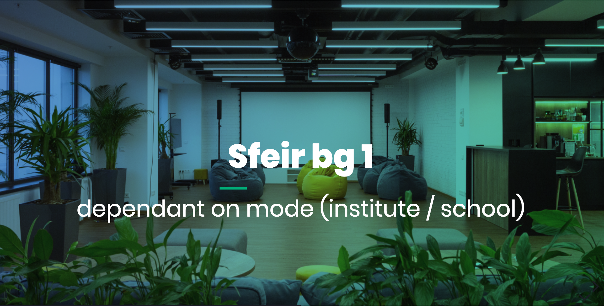

- `transition-bg-green-1`
  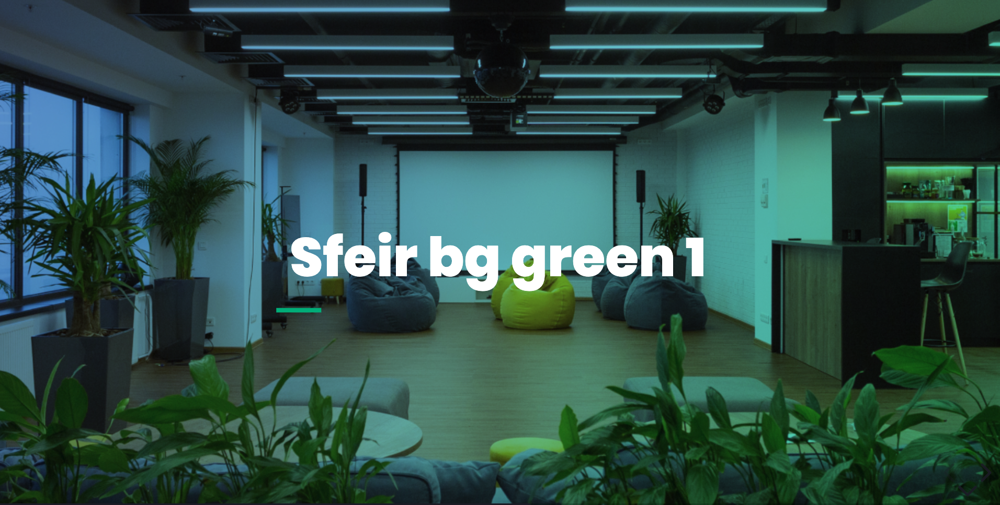

- `transition-bg-green-2`
  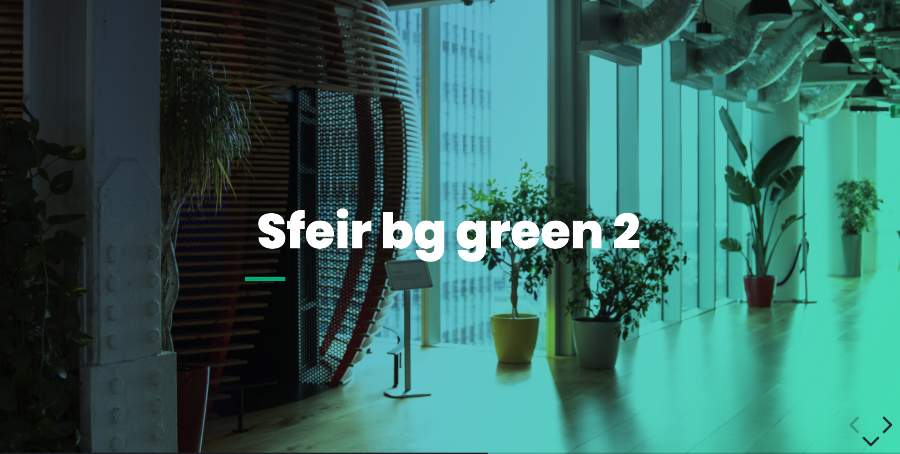

- `transition-bg-green-3`
  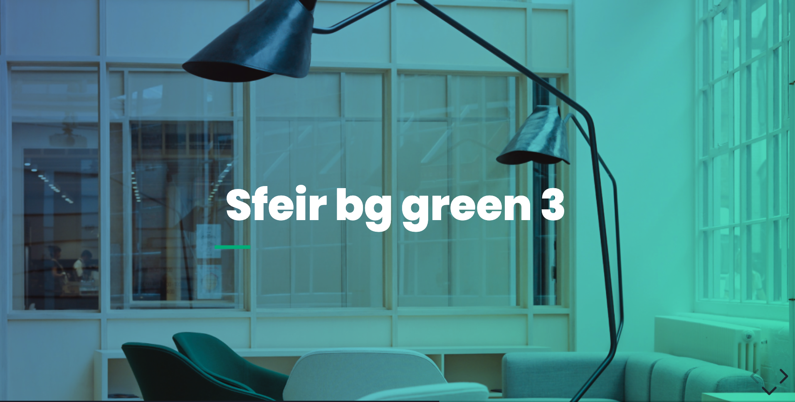

- `transition-bg-green-4`
  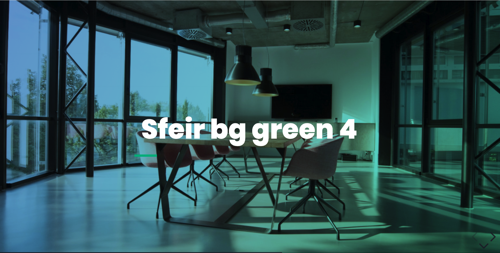

- `transition-bg-green-5`
  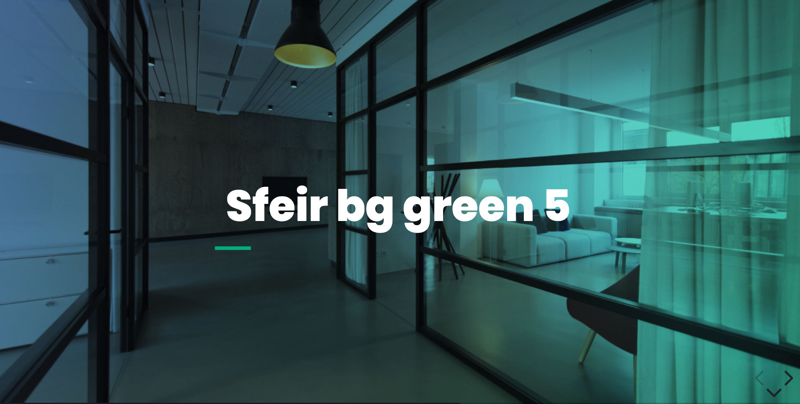

- `transition-bg-green-6`
  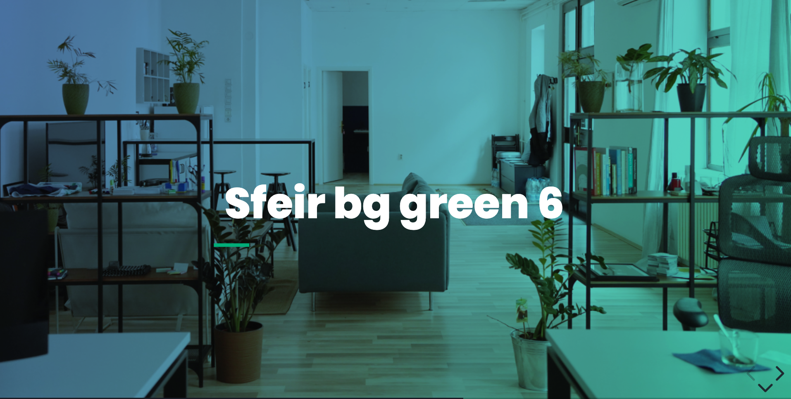

- `transition-bg-blue-1`
  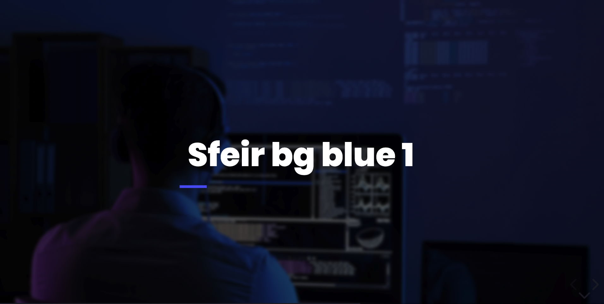

- `transition-bg-blue-2`
  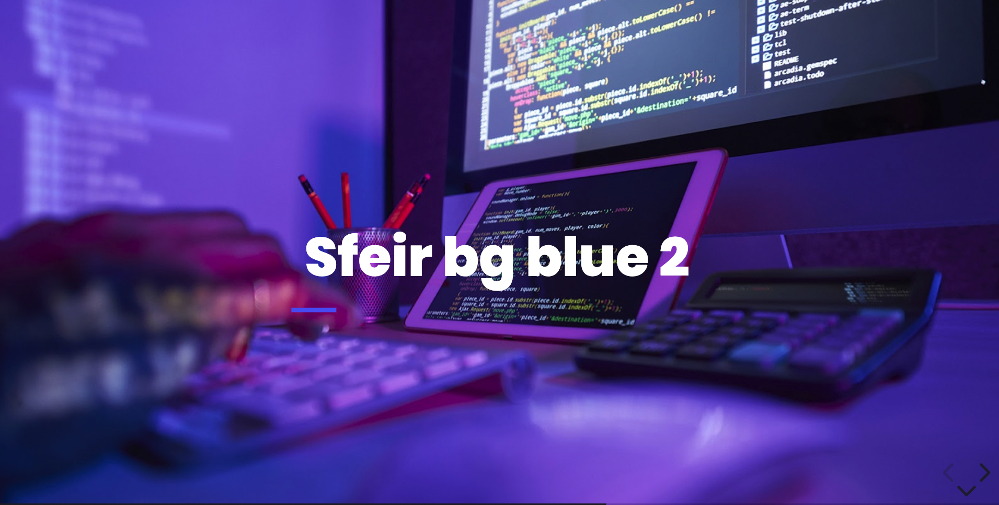

- `transition-bg-blue-3`
  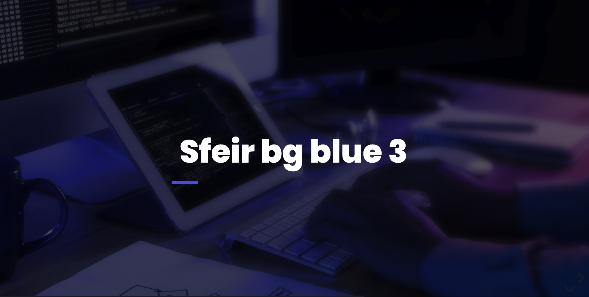

### Blur area slides

There is a way to show content in a blur area for introducing pause in your training

```md
<!-- .slide: class="bg-blur" -->

<br>

### C'est l'heure de la pause

<br>

<!-- .element: style="--tc-icon-size:300px; --tc-icon-color:var(--light-grey);" -->

<br>

On se retrouve à

<!-- .element: class="center" -->
<br>

<!-- .element: style="--tc-icon-color:var(--light-grey);" --> 10h
```

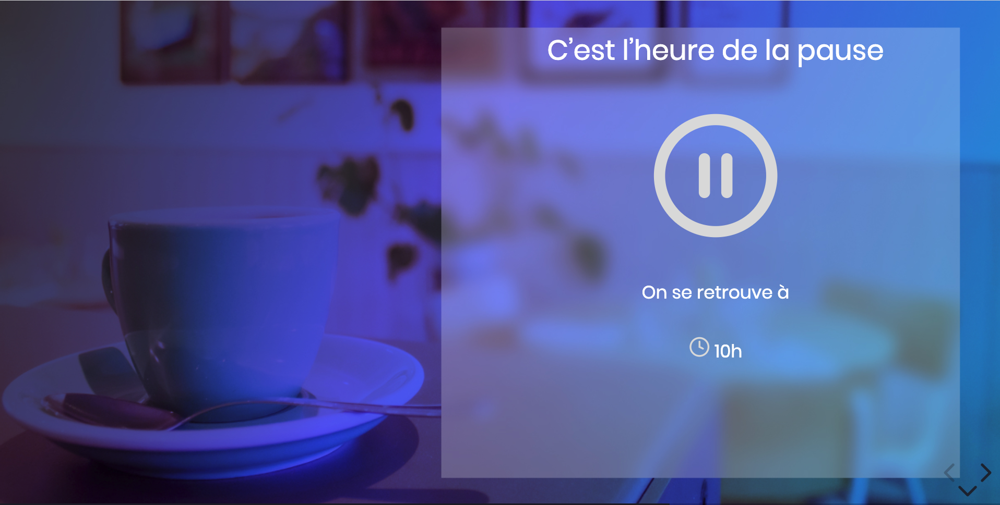

## Exercices

To produce exercices slides:

```md
<!-- .slide: class="exercice" -->

# Exercice Title

## Exercice

<br>
1. First step
2. Second step
3. Third step
<br>
Additionnal Advice
### Step: push-1
```

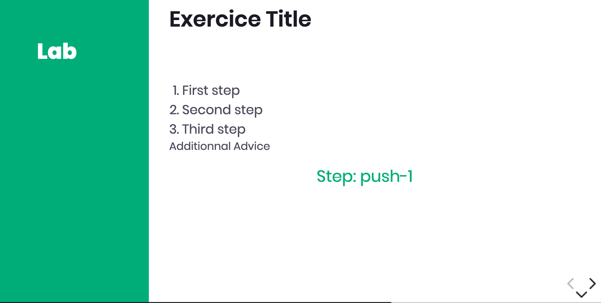

### Create content for the restitution only

With this configuration option you can easily create content that is different between, what you will play on stage and what you will give to your attendees without a complete rewrite of your slides. This configuration is a pair between a key specified in your index.html or URL parameters and a key present in your slides.

**Index.html Configuration**

```html
<body>
    <div class="reveal">
        <div class="slides" data-type="prez">...</div>
    </div>
</body>
```

https://sfeir-school-theme.netlify.app/index.html?data-type=prez#/

**Slides configuration**

```markdown
<!-- .slide: data-type-show="prez" -->

## A slide for prez only

A few words !
```

The slide 'A slide for prez only' will be visible only if the attribute `data-type-show` on index.html is set to "prez" or if the type URL parameter is set to prez.
Note that as for the themes described above, the URL parameter takes precedence over the HTML attribute.

With this technique, you can easily create 2 versions of your index.hml, one with `data-type-show` to **prez** and one with `data-type-show`to **full** and in your slides, you have something like that

```markdown
<!-- .slide: data-type-show="prez" -->

## A slide for prez only

A few words !

##==##

<!-- .slide: data-type-show="full" -->

## A slide for publication only

Lorem ipsum dolor sit amet, consectetur adipiscing elit. Proin nec risus leo. Vestibulum condimentum orci in urna auctor aliquet. Quisque mi erat, placerat non porttitor ut, gravida eu erat. Fusce semper ipsum vel nibh porttitor aliquam. Cras sed porttitor est, id scelerisque odio. Pellentesque sit amet imperdiet ex. Aliquam erat.
```

If nothing is set in the markdown, the slide will be available for both versions.

You can also set multiples data-type-show in the same slide (separated by a space) to create kind of specifics configurations for your slides.

```markdown
<!-- .slide: data-type-show="prez other" -->
```

## Print the slides

To print your presentation, simply follow the reveal.js tutorial : [Pdf Export](https://revealjs.com/pdf-export/)

| Configuration                                                   | Description                                                   |
| --------------------------------------------------------------- | ------------------------------------------------------------- |
| `index.html?print-pdf&show-notes`                               | Show the notes in the exported page.                          |
| `<div class="slides" data-show-notes/>`                         | Show the notes in the exported page.                          |
| `<div class="slides" data-show-notes="separate-page"/>`         | Show the notes of the exported page in a separate page.       |
| `<div class="slides" data-pdf-max-pages-per-slide="1"/>`        | Ensures that one slide is printed as one page.                |
| `index.html?print-pdf&pdf-max-pages-per-slide=1`                | Ensures that one slide is printed as one page.                |
| `<div class="slides" data-pdf-max-pages-per-slide="<number>"/>` | Ensures that one slide is printed as `<number>` page maximum. |
| `<div class="slides" data-pdf-dont-separate-fragments/>`        | Ensure that fragments are not separated in multiple pages.    |
| `index.html?print-pdf&pdf-dont-separate-fragments`              | Ensure that fragments are not separated in multiple pages.    |
