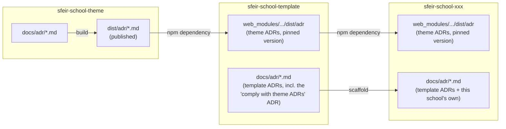

# 0000. Adopt Architecture Decision Records (ADRs)

### Submitters

- Jean-François Garreau (SFEIR)

## Change Log

- [pending](TBD — PR not yet opened) 2026-09-23

## Referenced Use Case(s)

No formal use-case document exists. This ADR is self-motivating — see
Context below.

## Context

`sfeir-school-theme` sits at the bottom of a three-tier chain:

- **`sfeir-school-theme`** (this repo) — the RevealJS theme, published to
  npm. `dist/` is its public contract.
- **`sfeir-school-template`** — a scaffold that depends on the theme and
  adds trainer-facing structure (`trainers/`, `slides/`, `labs/`).
- **`sfeir-school-xxx`** — one repository per concrete training, generated
  from the template.

A decision made in the theme (a breaking API, a naming convention, a
build-tooling choice) affects the template, then every generated `xxx`
instance. Today nothing is written down: contributors have no way to know
*why* something is the way it is, the same trade-off gets re-argued at each
tier, and both projects are open-source / inner-source repos with a
rotating contributor base — an undocumented decision is lost the moment
its author moves on.



Out of scope for this ADR: how a school (the `xxx` in `sfeir-school-xxx`)
gets named. That is a separate concern and deserves its own ADR.

## Proposed Design

### 1. Numbering, and when a new file is created

Files are named `NNNN-kebab-slug.md`, zero-padded, sequential, never
reused — the convention this very file follows. One flat sequence per
repository — except in a school/template project, where the two founding
ADRs and each prefixed group (point 3) each keep their own independent
sequence.

A new file exists only for a new decision. A release or a git tag is never
by itself a reason to create a file — it's the *consequence* of decisions
already made, not a decision itself. Once a decision ships, that fact is
recorded as one more Change Log line on its existing file, e.g.:

```
- [approved](<PR URL>) 2026-10-01 — shipped in v4.1.0
```

This applies to every ADR, including a hypothetical one about the theme's
own release policy: it stays one file, revised through its Change Log.

### 2. Propagation, and the compliance rule

The theme publishes `docs/adr/` as `dist/adr/` (a normal build output —
implementation detail, not part of this decision). The template and every
generated `xxx` instance consume it exactly as they already consume the
theme's compiled CSS/JS: as an npm dependency, materialized under
`web_modules/sfeir-school-theme/dist/adr`.

This carries an explicit rule, not just a copy mechanism: **the template,
and every instance generated from it, must comply with every ADR published
by the theme version they currently depend on.** Since compliance is tied
to "which theme version am I on," bumping that dependency is what brings a
theme's new or changed ADRs down into the template, and from there into
every instance — no extra step needed.

The template keeps one ADR of its own that states this obligation plainly
— see [[0001-comply-with-theme-adrs]], authored here so
`sfeir-school-theme-migrate` can seed it into any project it migrates. It
is a rule about the theme's ADRs, not a copy of their content.

### 3. Naming: bare numbers for the two founding ADRs, prefixed for the rest

Every project starts with exactly two bare-numbered ADRs, seeded by
`sfeir-school-theme-migrate`: `0000-adopt-adrs.md` and
`0001-comply-with-theme-adrs.md` (see [[0001-comply-with-theme-adrs]]).
Anything that comes after is prefixed, so it's never mistaken for one of
those two founding decisions:

- A theme ADR referenced or copied in for visibility beyond the two
  seeded ones: `theme-NNNN-kebab-slug.md`, its own sequence starting at
  `0000`.
- A decision local to that project (e.g. a Gradle setup choice): prefixed
  with that project's own slug instead — `<xxx>-NNNN-kebab-slug.md` (or
  `template-NNNN-kebab-slug.md` for the template itself) — its own
  sequence starting at `0000`.

## Considerations

- **A file per theme release vs. one flat sequence.** Dropped: a release
  isn't a decision, and the Change Log already records which release
  shipped a decision — a second numbering scheme would just track the same
  fact twice.
- **A filesystem symlink vs. dependency consumption.** We are not proposing
  a literal symlink — that only works when theme, template, and instances
  sit in the same workspace, which they don't across an `npm install`
  boundary. What downstream tiers actually point at is the theme's
  *built/published* ADRs (`dist/adr`, reached through the existing
  `web_modules` dependency copy), never the raw `docs/adr` sources.
- **A special `custoADR.md` file vs. a prefixed convention.** The point was
  never a dedicated filename — just that every school is free to add ADRs
  when it needs to. Reusing the bare `NNNN-slug.md` convention for those
  was considered, but rejected: it would make a school's own ADR
  indistinguishable at a glance from the two founding ones every project
  starts with — hence the `theme-`/`<xxx>-` prefixes (point 3).

## Decision

- ADRs are adopted at all three tiers, using the edgex template, with the
  Change Log as the sole revision mechanism — a decision is edited in
  place, never superseded by a new file.
- Numbering: flat, sequential, zero-padded `NNNN-slug.md` per repository. A
  release never creates a file by itself (point 1).
- The theme publishes `dist/adr/`; the template and every instance consume
  it via the existing npm/`web_modules` path and **must comply** with the
  ADRs of the theme version they depend on (point 2).
- Only `0000-adopt-adrs.md` and `0001-comply-with-theme-adrs.md` are
  bare-numbered. Any school, including the template itself, can add its
  own ADRs directly in its own `docs/adr/`, but prefixed
  (`theme-NNNN-slug.md` for a referenced theme ADR, `<xxx>-NNNN-slug.md`
  or `template-NNNN-slug.md` for a local decision), each its own sequence
  starting at `0000` (point 3).
- Out of scope, tracked as follow-up work:
  - the naming convention for a school (the `xxx` in `sfeir-school-xxx`) —
    its own future ADR;
  - the exact build wiring that publishes `docs/adr/` into `dist/adr/` in
    this repo, and the `prepare`/`postinstall`-style script that
    materializes `web_modules/.../dist/adr` in the template and in each
    instance — implementation work, not this ADR's decision;
  - scaffolding the first ADR files in `sfeir-school-template` and in the
    `sfeir-school-xxx` generator;
  - tooling to detect duplicate/out-of-order numbers — not needed at the
    current scale.

## Other Related ADRs

None at the time this ADR was written — it is the founding ADR of the
series. [[0001-comply-with-theme-adrs]] through
[[0014-commit-and-branch-convention]] are the first decisions to build on
the numbering, edgex-template, and Change-Log-only-revision conventions
established here.

## References

- [Architecture Decision Record template by edgex](https://github.com/architecture-decision-record/architecture-decision-record/blob/38ae60b13ed9725ee3e350431a7ad49228539bd9/locales/en/templates/decision-record-template-by-edgex/index.md)
